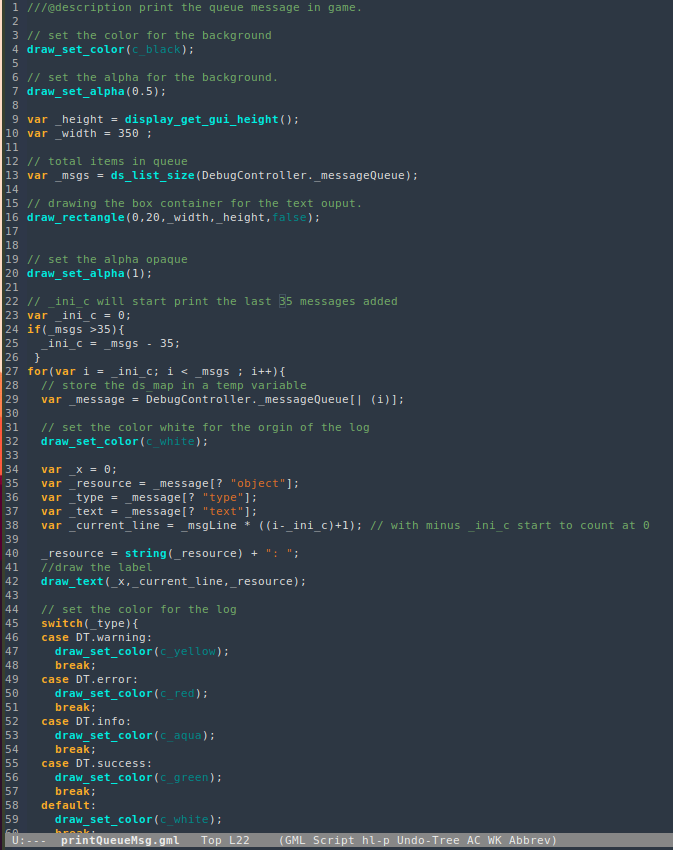

# gml-mode
GML major mode for emacs, supports Game Maker Language [GML](https://docs2.yoyogames.com/source/_build/3_scripting/3_gml_overview/index.html).

Provides syntax highlighting, indentation and auto-complete.

# Install
Clone this repo and copy the lisp file into your .emacs.d folder.

	git clone https://github.com/nexhero/gml-mode.git

Add this line to your init file.

	(load-file "~/.emacs.d/gml_mode.lisp")

Turn on the mode

	M-x gml-mode

To add auto-complete dictionary.

[auto-complete manual](https://github.com/auto-complete/auto-complete/blob/master/doc/manual.md)
